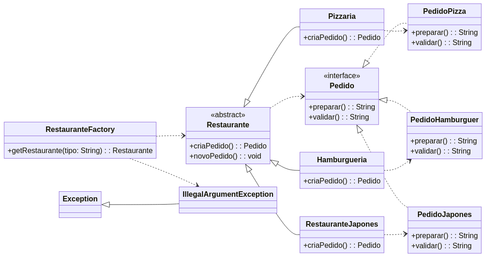

# Implementação do Padrão de Projeto: Factory Method

O **Factory Method** é um padrão de projeto criacional que fornece uma interface para criar objetos em uma superclasse, mas permite que as subclasses alterem o tipo de objetos que serão criados. Ele promove o baixo acoplamento ao separar a lógica de construção de um objeto do código que o utiliza (o "cliente").

Os componentes principais do padrão são:
- **Product (Produto):** A interface ou classe abstrata que define o objeto a ser criado.
- **ConcreteProduct (Produto Concreto):** As classes que implementam a interface do produto.
- **Creator (Criador):** A classe abstrata que declara o "método de fábrica" (factoryMethod()), que retorna um objeto do tipo Product.
- **ConcreteCreator (Criador Concreto):** As subclasses que implementam o factoryMethod() para criar e retornar uma instância de um ConcreteProduct específico.

## Cenário Aplicado: Sistema de Entrega de Comida
Para esta implementação, foi escolhido o cenário de um **sistema de entrega de comida**. A ideia é que diferentes tipos de restaurantes (fábricas) criem diferentes tipos de pedidos (produtos).

A estrutura ficou definida da seguinte forma:
- Product: Pedido (interface que define o que é um pedido).
- ConcreteProduct:
    - PedidoPizza
    - PedidoHamburguer
    - PedidoJapones
- Creator: Restaurante (classe abstrata que define o método criaPedido() e novoPedido()).
- ConcreteCreator:
    - Pizzaria (fábrica que cria PedidoPizza).
    - Hamburgueria (fábrica que cria PedidoHamburguer).
    - RestauranteJapones (fábrica que cria PedidoJapones).
- Factory de Creators: RestauranteFactory (classe estática que, dado um String com o tipo, retorna a instância do Restaurante apropriado).

### Estrutura do Projeto
O projeto foi organizado utilizando a estrutura padrão do Maven.

```
├──pom.xml
└──src/
    ├── main/java/padroescriacao/factorymethod/
    │   ├── Pedido.java                # Product (Interface)
    │   ├── PedidoPizza.java           # ConcreteProduct
    │   ├── PedidoHamburguer.java      # ConcreteProduct
    │   ├── PedidoJapones.java         # ConcreteProduct
    │   ├── Restaurante.java           # Creator (Classe Abstrata)
    │   ├── Pizzaria.java              # ConcreteCreator
    │   ├── Hamburgueria               # ConcreteCreator
    │   ├── RestauranteJapones.java    # ConcreteCreator 
    │   └── RestauranteFactory.java    # Factory de Creators
    └── test/java/padroescriacao/factorymethod/
        ├── PedidoHamburguerTest.java
        ├── PedidoJaponesTest.java
        ├── PedidoPizzaTest.java
        └── RestauranteFactoryTest.java
```

### Diagrama 


### Tecnologias Utilizadas
- Java 11: Linguagem de programação principal.
- Maven 3.8+: Ferramenta de automação de build e gerenciamento de dependências.
- JUnit 5: Framework para a escrita e execução de testes unitários.